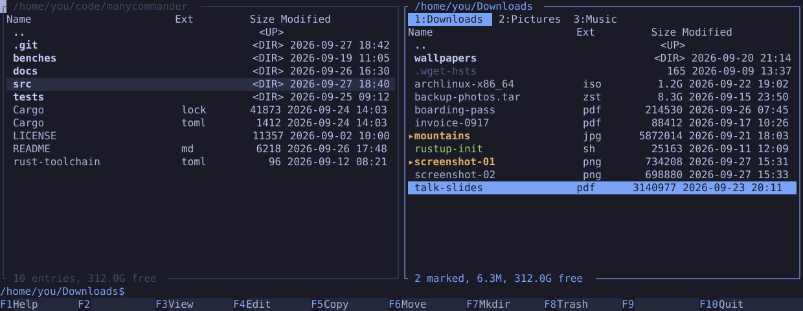

# manycommander

A dual-pane file manager for the Omarchy terminal.

Two panels, the F-key verbs and a command line, in the Total Commander tradition.
manycommander wears the active Omarchy theme and changes with it. A copy or a move
never leaves a half-written file behind.

**Documentation: [manycommander.app](https://manycommander.app)** -- install, launch, the
keymap, configuration, theming, and what the file operations guarantee.



## Install

Linux 6.8 or later, a stable Rust toolchain, and a terminal with truecolor and the kitty
keyboard protocol. Ghostty, foot, Alacritty and Kitty, the terminals Omarchy ships, all
qualify.

```bash
cargo install --git https://github.com/manyfold-dk/manycommander --root ~/.local
```

This builds a release binary and puts `manycommander` in `~/.local/bin`. Run the command
again to update. `cargo uninstall --root ~/.local manycommander` removes the binary and
leaves the config and the saved session in place.

## Launch

Bind it in `~/.config/hypr/bindings.lua`. `focus = true` brings a running window forward
instead of opening a second one.

```lua
o.bind("SUPER + E", "File manager (dual pane)", { tui = "manycommander", focus = true })
```

Press `Super+E`. The left panel opens in the working directory and the right one in your
home. After that, every start restores the last tabs. `F1` shows the keymap.

From a terminal: `manycommander` restores the last session, `manycommander ~/Downloads`
sets the left panel, and a second argument sets the right one.
[Launch options](https://manycommander.app/docs/launch/).

## What it does

| | |
|---|---|
| Live theme | Reads the active Omarchy palette and recolours when the theme changes. Nothing to configure. [How theming works](https://manycommander.app/docs/theme/) |
| F-keys | F3 view, F4 edit, F5 copy, F6 move, F7 mkdir, F8 trash. Marks, glob selection, quick search, tabs per panel and a shell command line come with them. [Keymap](https://manycommander.app/docs/keys/) |
| Copy and move | A copy is written under a temporary name and renamed into place, so a file you can see is complete. An overwrite replaces the old file atomically. A move across filesystems deletes the source only after the copy is flushed, so a crash can leave a file in both places, never in neither. [What each operation guarantees](https://manycommander.app/docs/file-operations/) |
| Trash | F8 moves to the freedesktop.org trash, the same one Nautilus and `gio` use. It never copies across filesystems. Deleting for good is Shift+F8, and it waits until you type `delete`. [Durability after a crash](https://manycommander.app/docs/durability/) |

The optional config file is `~/.config/manycommander/config.toml`. Every key is optional.
[Configuration](https://manycommander.app/docs/configuration/).

## Development

User documentation lives in [site/content/docs/](site/content/docs/) and is published at
[manycommander.app/docs](https://manycommander.app/docs/). Change it there.

The design is [docs/specs/2026-09-27-manycommander-design.md](docs/specs/2026-09-27-manycommander-design.md).
The implementation plan and its execution record are in [docs/plans/](docs/plans/).

```bash
scripts/install-hooks.sh     # the pre-push hook runs scripts/check.sh full
scripts/check.sh quick       # format, lint, unit tests
scripts/check.sh full        # every test (skips fail), cargo-deny, publication gate
scripts/check.sh ci          # what GitHub Actions runs: skips allowed, shapes-only gate
scripts/bench/run.sh         # A-P-1 to A-P-7; results in docs/perf/history.md
```

`full` expects `MC_XDEV_DIR` on a second filesystem (default `/dev/shm/mc-xdev`), btrfs under
`target/`, and user namespaces (`unshare -rm`) for the bind-mount tests. `ci` runs the same
tests and lets a missing capability print `SKIP` and the reason.

The site is a [Zola](https://www.getzola.org/) project in [site/](site/), served by a
Cloudflare Worker ([site/worker.js](site/worker.js)). The workflow
[.github/workflows/site.yml](.github/workflows/site.yml) checks it on every change and
deploys it from `main`; the one-time setup is
[docs/runbooks/site-first-deploy.md](docs/runbooks/site-first-deploy.md).

```bash
scripts/site.sh serve        # live preview on http://localhost:1111
scripts/site.sh check        # build and check links
scripts/site.sh worker       # wrangler deploy --dry-run, then the Worker's redirect and headers
cargo run --example site_screens   # regenerate site/static/screens/ from the installed themes
```

Report a vulnerability through [GitHub private vulnerability reporting](https://github.com/manyfold-dk/manycommander/security/advisories/new).
See [SECURITY.md](SECURITY.md).

## License

Apache-2.0. manycommander is an independent project for [Omarchy](https://omarchy.org/).
See [LICENSE](LICENSE).
